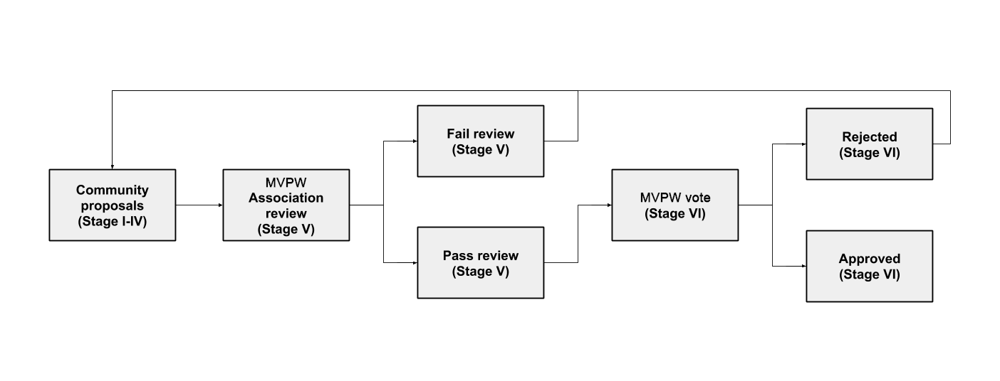

# MVPWGP-1: The MVP Workshop Governance Proposal Process

**Version 1.0.0**

## What is an MVPWGP?
MVPWGP stands for MVP Workshop Governance Proposal. An MVPWGP is a document that details a change to the management, allocation, or use of shared resources owned or directly influenced by the MVP Workshop. All MVPWGPs must be consistent with the goals and values put forth in [MVPWGP-0](MVPGP-0.md), i.e.  (the MVP Workshop Manifesto) and compliant with the requirements outlined in this document, MVPWGP-1. The MVPWGP author is responsible for building consensus within the community for their MVPWGP and documenting dissenting opinions.

## MVPWGP process rationale
The purpose of the MVPWGP Process ("the AGP process") is to provide a structured process for making changes to the shared resources of the MVPW. For these shared resources, governance processes are needed to grant or deny access and approve or reject proposed changes. By creating a fair, lightweight, and transparent MVPWGP process, the MVPWGP-1 authors hope to give MVP Workshop people a meaningful say in the governance of the MVP Workshop Association and the MVPW and increase the chances of success for both.

## Proposal workflow
Parties directly involved in the process are the _MVPWGP author_ (you), the _MVPW Association (“the Association”)_, and _MVPW voters_.

Proposals follow this workflow:

* Stage I: Select MVPWGP Track
* Stage II: Pre-proposal
* Stage III: Work In Progress
* Stage IV: Draft Proposal
* Stage V: Final Proposal
* Stage VI: MVPW Vote

At a high level, the MVPWGP-1 workflow looks like this:

### Stage I: Select MVPWGP Track
Before you spend time working on a proposal, make sure the proposal complies with MVPWGP-1 and has a chance of passing review by your peers. Review the MVPWGP tracks and their requirements then select the track that you think is best for your proposal. If your proposal meets the requirements, it has a much greater chance of being accepted and approved by MVPW voters.

There are four tracks that an MVPWGP can be categorized into. Select the one you think is best for your MVPWGP:

* Association: proposals for making changes to the Association
* Finance: proposals for transferring funds from the Association multisig
* Meta: proposals for changing AGP-0 or AGP-1 (“changing the way things are changed”)
* Proclamations: proposals for making a public statement on behalf of the Aragon Network

Proposals that cannot be categorized into one of these tracks will likely be denied by AGP Editors. At the discretion of AGP Editors, a proposal may be categorized as “Other” until a new track is approved as part of a Meta AGP.

In addition to the requirement that all MVPWGPs must be consistent with MVPWGP-0, each track has its own requirements for MVPWGPs as follows:

**Association**  
Proposals made to the Association track must affect one or more of the following:

* Association-owned assets, excluding funds held in the [Association multisig](https://wiki.aragon.org/documentation/multisigs/association/)
  * E.g. “Should the Aragon trademark be dedicated to the public domain?”
* Association policies
  * E.g. “Should the Aragon Code of Conduct be updated to include a community-wide ban on Carlos Matos memes?”

**Finance**  
Proposals made to the Finance track must affect the movement of assets held by the [Association multisig](https://wiki.aragon.org/documentation/multisigs/association/). The Association will have discretion over which multisig transfers must go through the AGP process.

* All code and content funded through the AGP process must be released under one of the following licenses:
  * Creative Commons (CC0, CC-BY, CC-SA, CC-BY-SA)
  * GPL
  * AGPL
  * MIT

**Meta**  
Proposals made to the Meta track must affect changes to MVPWGP-0 or MVPWGP-1. The Association has the power tofix errata in AGP-0 or AGP-1 on an as-needed basis without going through the MVPWGP process. All other proposals to modify MVPWGP-0 or MVPWGP-1 should be made to the Meta track.
* E.g. “Should the min. acceptance quorum of Aragon Network votes be increased?”

**Proclamations**  
Proposals made to the Proclamations track must be consistent with the Aragon Manifesto.
* E.g. “The Aragon Network declares February 10th to be Aragon Day.”

### Stage II: Pre-proposal
During Stage II you should seek feedback on your MVPWGP idea by sharing it with your peers in the Aragon community and soliciting their feedback. Examples of appropriate venues to share your AGP idea include:

* The [OKR egnineering section](https://mvpworkshop.slack.com/messages/CC4L6V35H/mentions/) in the MVP Workshop slack
* The [Issues section](https://github.com/aragon/MVPWGPs/issues) of the [MVPWGP repo](https://github.com/MVPWorkshop/MVPWGP)

Be open-minded and respectful of all feedback you receive. Adjust your proposal to address serious concerns as they come up to increase the odds of your proposal passing review in later stages.

### Stage III: Work In Progress
After you have asked the MVP Workshop team whether an idea has any chance of support and have received sufficient feedback to feel confident going forward, you can create a draft MVPWGP as a pull request to the MVPWGP repo. Use a template from the Template section below to ensure you are including all the necessary information. The draft MVPWGP file should be given a temporary name, which the some Editor will rename when the MVPWGP is assigned a number.

* If agreeable, someone from team MVPWGP will assign the MVPWGP a number (generally the PR number related to the MVPWGP), move the proposal from Stage III to Stage IV by updating the status in the MVPWGP, and merge your pull request.
* Reasons for denying Stage IV status include being too unfocused, too broad, duplication of effort, being technically unsound, not providing proper motivation or addressing concerns by reviewers, or not in compliance with MVPWGP-1.

**Templates**  
Below is a list of MVPWGP templates for each track. Copy the template for the track your AGP is in, fill it out, and submit the pull request with your AGP for review. Sections marked as “required” in the template must be completed. Note that all proposals must be licensed CC-0.

* [Association](../templates/association_template.md)
* [Finance](../templates/finance_template.md)
* [Meta](../templates/meta_template.md)
* [Proclamations](../templates/proclamation_template.md)

### Stage IV: Draft Proposal
Once the first draft has been merged into the MVPWGP repo, you may submit follow-up pull requests with further changes to your draft until such point as you believe the MVPWGP to be mature and ready to proceed to Stage V. After a proposal in Stage IV has been thoroughly reviewed, you may request that an MVPWGP Editor moves the proposal from Stage IV to Stage V.

* A request to move the proposal from Stage IV to Stage V will be denied if material changes are still expected to be made to the draft. No changes can be made to an AGP while it is in Stage V or VI.

### Stage V: Final Proposal
An MVPWGP in Stage V is the final version that will appear on the ballot during the next MVP Workshop vote cycle. MVPWGPs that move from Stage IV to Stage V are reviewed by the MVPW Association Board of Directors and, if approved during the pre-vote review session, are added to the list of MVPWGPs that will be submitted to the MVPW for a vote. Approval or rejection of an MVPWGP during Stage V is made at the discretion of the Association board.

The Association board review session **begins** two weeks before the next MVPW vote cycle is scheduled to begin and **ends** one week before the next vote cycle is scheduled to begin.

### Stage VI: MVPW team Vote
All MVPWGPs that have moved to Stage V since the last MVPW vote cycle and have been approved by the Association board are included on the ballot in the current vote cycle. During the vote cycle, MVPW voters will review proposals on the ballot and cast their votes. 

If a vote on an MVPWGP produces a Rejected result, then the MVPWGP must revert to Stage IV or be withdrawn by the author. If a vote on an MVPWGP produces an Approved result, then the MVPWGP will either be executed automatically by the MVPW or else dutifully executed by a manager designated in the MVPWGP (or designated by the Association board if no manager is designated in the MVPWGP).

**Support required**  
With the exception of Meta track proposals, the minimum support required for approval is >50% of all votes cast, an “absolute majority”. 

For Meta track proposals, the minimum support required for approval is >66.6666666666666666% of all votes cast, a “supermajority”. 

## History
This document borrows from [Aragon Governance Proposal AGP-1)](https://github.com/aragon/AGPs/blob/master/AGPs/AGP-1.md), which borrows from [Ethereum’s EIP-1](https://github.com/ethereum/EIPs/blob/master/EIPS/eip-1.md) written by Martin Becze and Hudson Jameson, which itself was derived from [Bitcoin's BIP-0001](https://github.com/bitcoin/bips/blob/master/bip-0001.mediawiki) written by Amir Taaki, which in turn was derived from [Python's PEP-0001](https://www.python.org/dev/peps/pep-0001/). In many places text was simply copied and modified. Although the PEP-0001 text was written by Barry Warsaw, Jeremy Hylton, and David Goodger, they are not responsible for its use in the Aragon Governance Process, and should not be bothered with governance questions specific to Aragon or the AGP process. Please direct all comments and questions to the AGP Editors.
